# Rendu intermédiaire — EDA (Polish & USA)
Ce document résume l’**exploration des données (EDA)** réalisée avant modélisation : qualité des données, cible, valeurs manquantes, distributions et premiers signaux.

## 1) Vue d’ensemble
| Dataset        |   Rows |   Cols |   Positive rate (%) |   Missing avg (%) |
|:---------------|-------:|-------:|--------------------:|------------------:|
| Polish (Year1) |   7027 |     65 |               3.857 |             1.277 |
| USA            |  78682 |     22 |               6.634 |             0     |

### Points clés
- Polish : taux de faillite ≈ **3.86%** sur **7,027** lignes.
- USA: taux de faillite ≈ **6.63%** sur **78,682** lignes.
- Valeurs manquantes en moyenne : Polish ≈ **1.28%**, USA ≈ **0.00%**.
- Les distributions des variables montrent des asymétries.
- On observe un drift temporel pour les USA, le taux de faillite varie significativement chaque année.

## 2) Cible (faillite)
### Polish

### USA
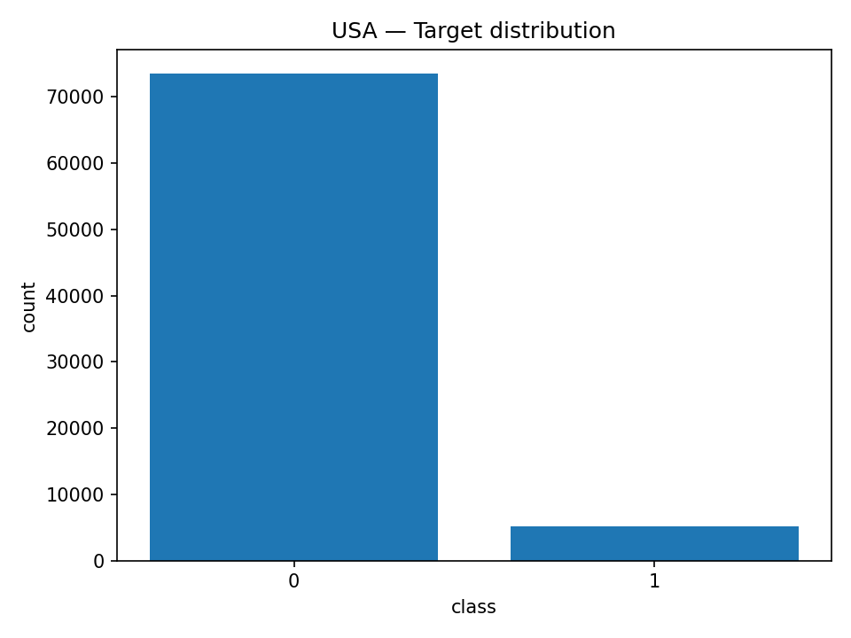

### USA — Drift temporel (taux de faillite par année)
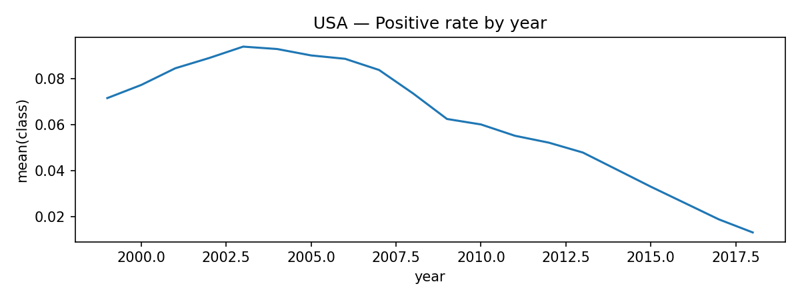

## 3) Valeurs manquantes
### Polish — Top features les plus manquantes
| feature   |   missing_% |
|:----------|------------:|
| Attr37    |      38.992 |
| Attr21    |      23.082 |
| Attr27    |       4.426 |
| Attr60    |       1.921 |
| Attr45    |       1.907 |
| Attr24    |       1.765 |
| Attr41    |       1.195 |
| Attr11    |       0.555 |
| Attr32    |       0.541 |
| Attr28    |       0.484 |

## 4) Distributions & séparation faillite / non-faillite
### Polish — Exemples (Attr1..Attr6)

### USA — Exemples (X1..X6)
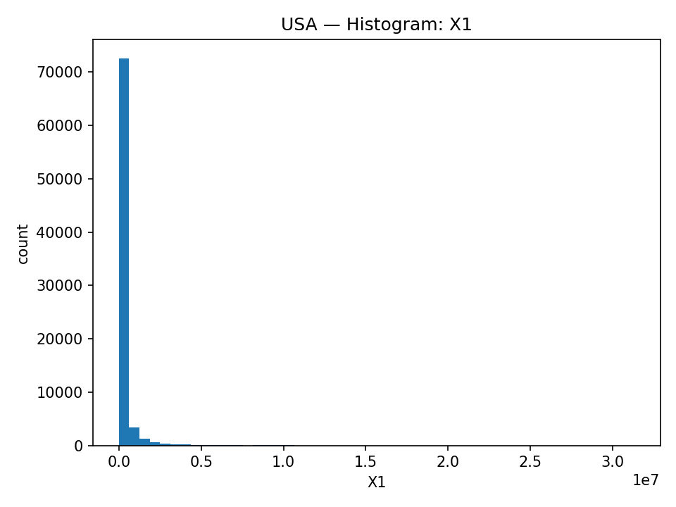

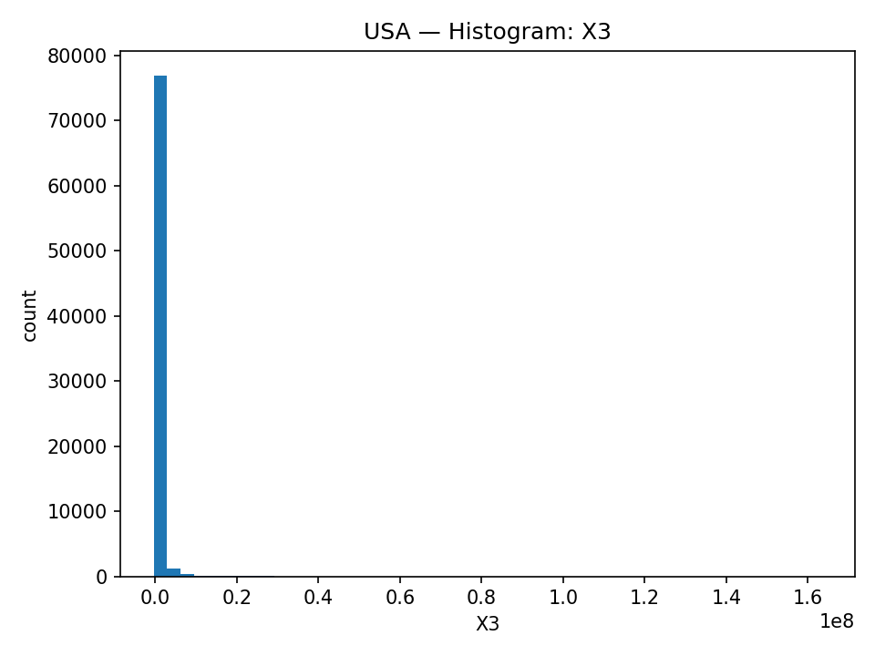

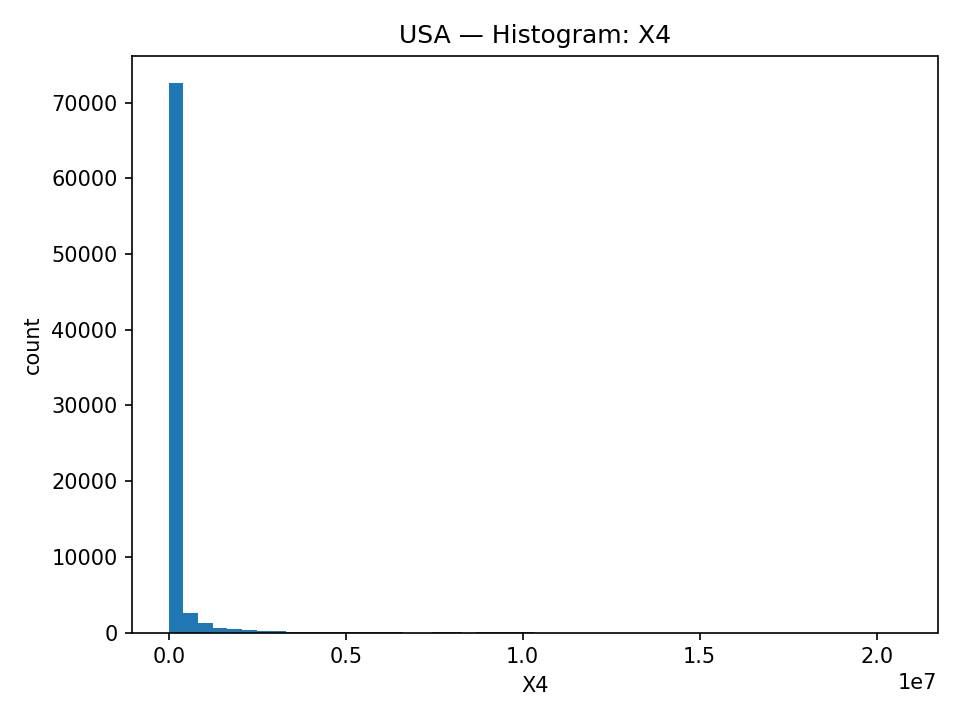

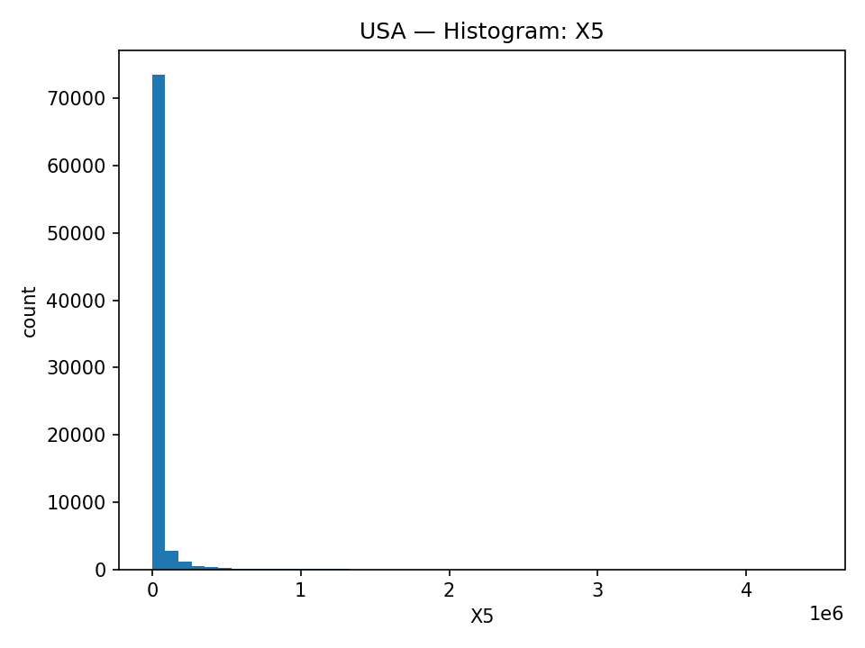

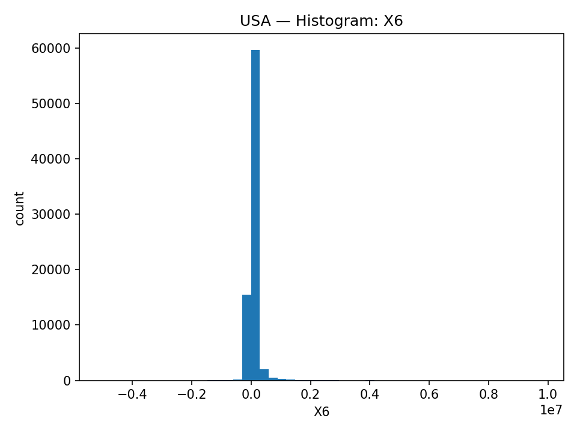

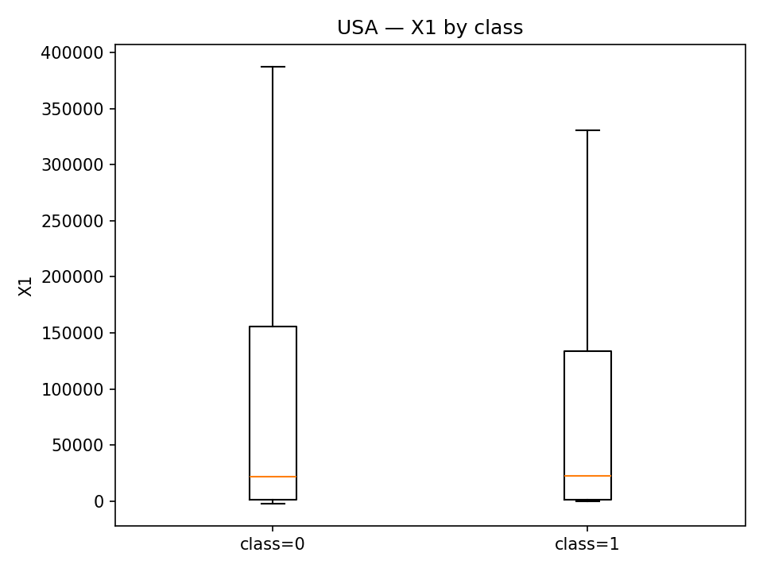

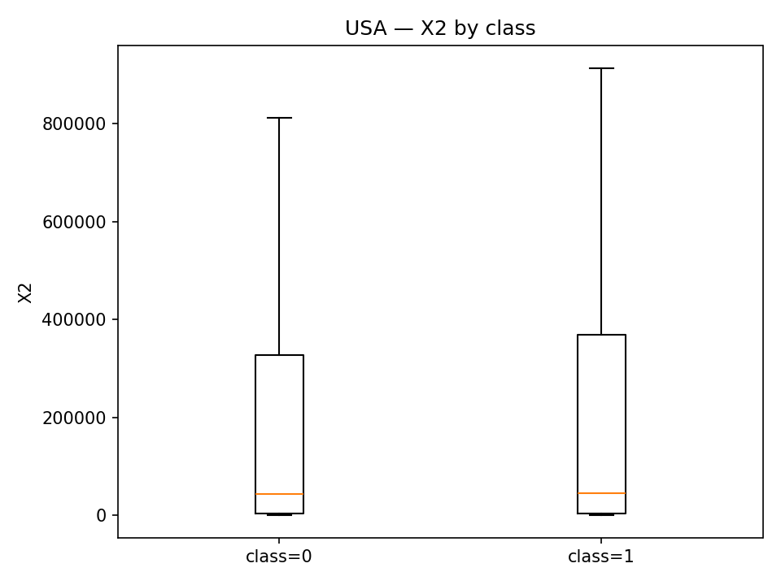

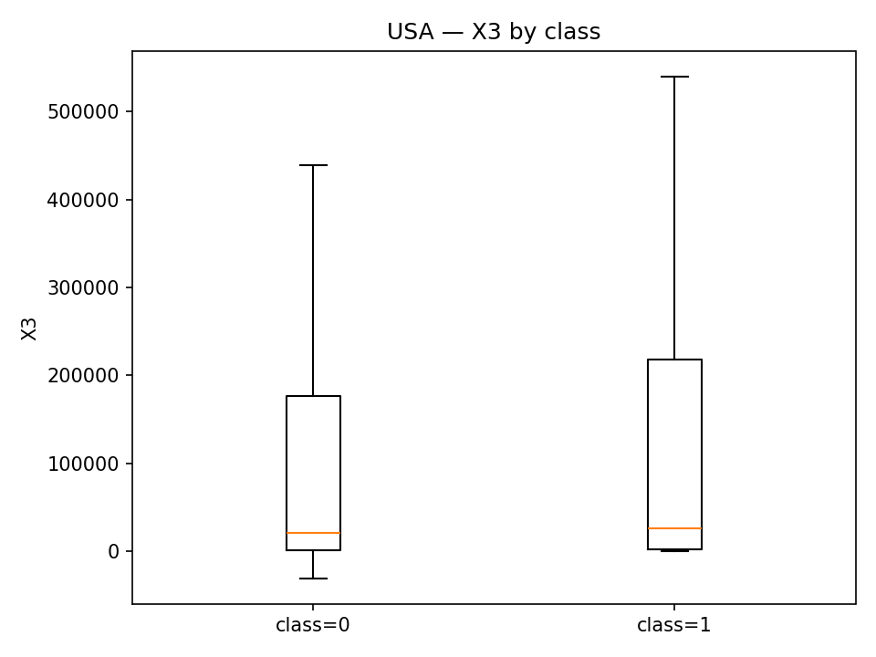

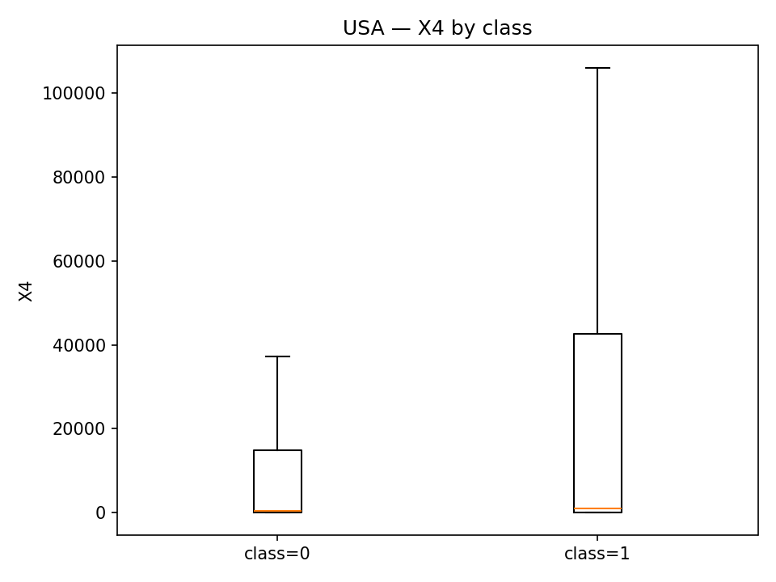

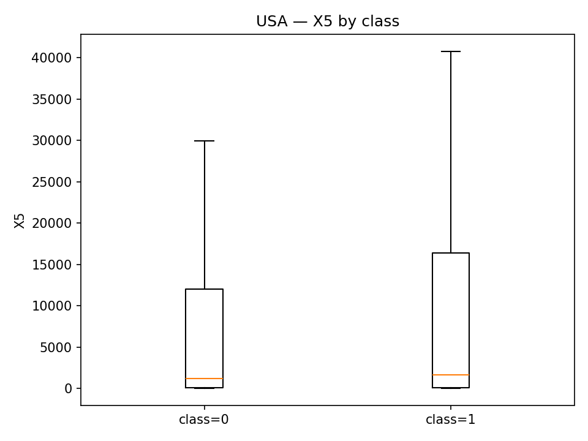

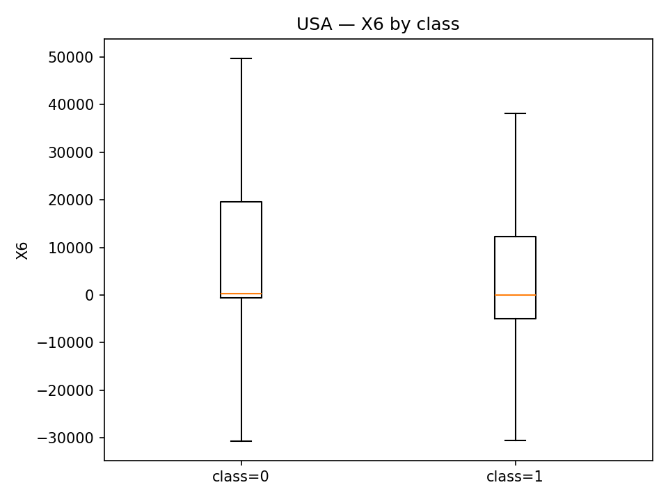

## 5) Corrélations (top paires)
Les corrélations élevées indiquent une possible **multicolinéarité** (important pour logreg) et confirment l’intérêt de modèles capables de gérer des interactions/non-linéarités.

### Polish — Top corrélations
| var1   | var2   |   abs_corr |
|:-------|:-------|-----------:|
| Attr14 | Attr18 |   1        |
| Attr7  | Attr14 |   1        |
| Attr7  | Attr18 |   1        |
| Attr56 | Attr58 |   1        |
| Attr20 | Attr56 |   0.999996 |
| Attr20 | Attr58 |   0.999996 |
| Attr10 | Attr38 |   0.99999  |
| Attr19 | Attr31 |   0.999987 |
| Attr43 | Attr44 |   0.999956 |
| Attr53 | Attr54 |   0.999917 |
| Attr9  | Attr36 |   0.999916 |
| Attr39 | Attr42 |   0.99987  |
| Attr30 | Attr49 |   0.999782 |
| Attr30 | Attr44 |   0.999764 |
| Attr20 | Attr43 |   0.999633 |

### USA — Top corrélations
| var1   | var2   |   abs_corr |
|:-------|:-------|-----------:|
| X14    | X17    |   1        |
| X3     | X14    |   0.825128 |
| X3     | X17    |   0.825128 |
| X14    | X18    |   0.779467 |
| X17    | X18    |   0.779467 |
| X6     | X7     |   0.7517   |
| X2     | X16    |   0.7414   |
| X3     | X18    |   0.738927 |
| X7     | X8     |   0.710262 |
| X4     | X16    |   0.695095 |
| X6     | X8     |   0.676555 |
| X10    | X17    |   0.675591 |
| X10    | X14    |   0.675591 |
| X1     | X8     |   0.667617 |
| X2     | X4     |   0.651055 |

## 6) Conclusion intermédiaire
- Les deux datasets sont **exploitables** pour une prédiction de faillite.
- La cible est **déséquilibrée** → PR-AUC, calibration, et risk buckets sont adaptés.
- USA : présence d’un **axe temporel** → split temporel recommandé (déjà intégré).
- Prochaine étape : entraînement, calibration, interprétation (importance variables / SHAP) et comparaison modèles.
