# Polish (Year1) — EDA

**Shape**: 7027 rows × 65 cols  
**Missing (global avg)**: 1.28%  
**Positive rate (class=1)**: 0.0386  
**Target counts**: `{'0': 6756, '1': 271}`  

## Missing values (top 20)
- `Attr37`: 38.99%
- `Attr21`: 23.08%
- `Attr27`: 4.43%
- `Attr60`: 1.92%
- `Attr45`: 1.91%
- `Attr24`: 1.76%
- `Attr41`: 1.20%
- `Attr11`: 0.56%
- `Attr32`: 0.54%
- `Attr28`: 0.48%
- `Attr53`: 0.48%
- `Attr64`: 0.48%
- `Attr54`: 0.48%
- `Attr46`: 0.44%
- `Attr33`: 0.43%
- `Attr12`: 0.43%
- `Attr4`: 0.43%
- `Attr63`: 0.43%
- `Attr40`: 0.43%
- `Attr47`: 0.41%

## Figures

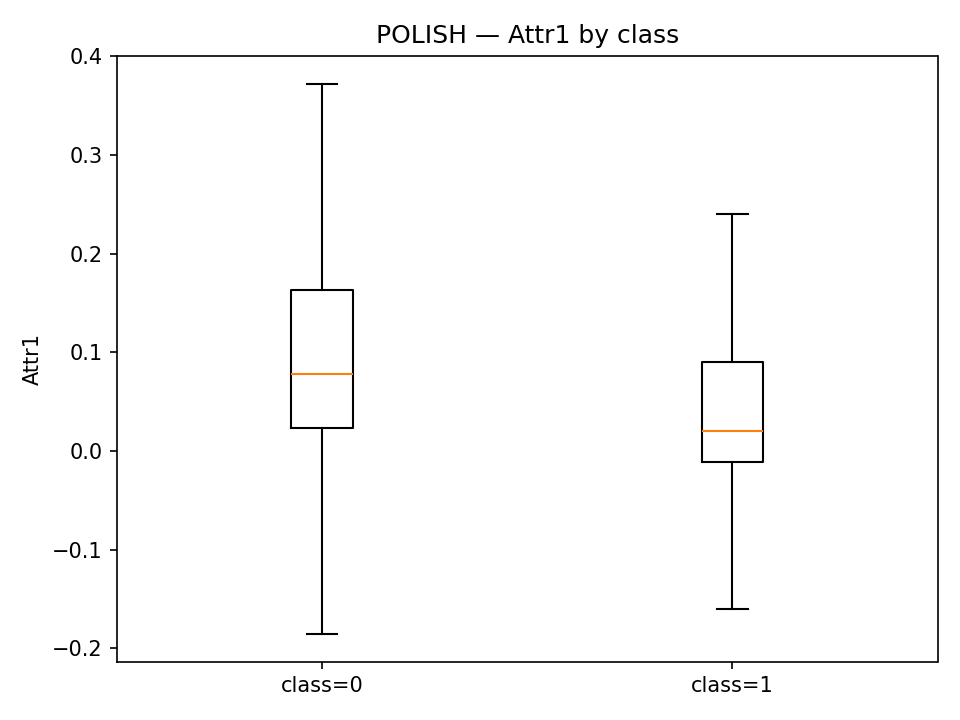

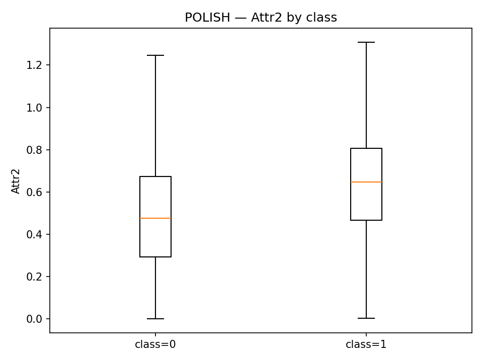

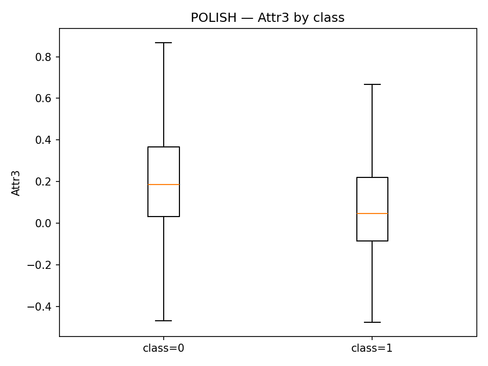

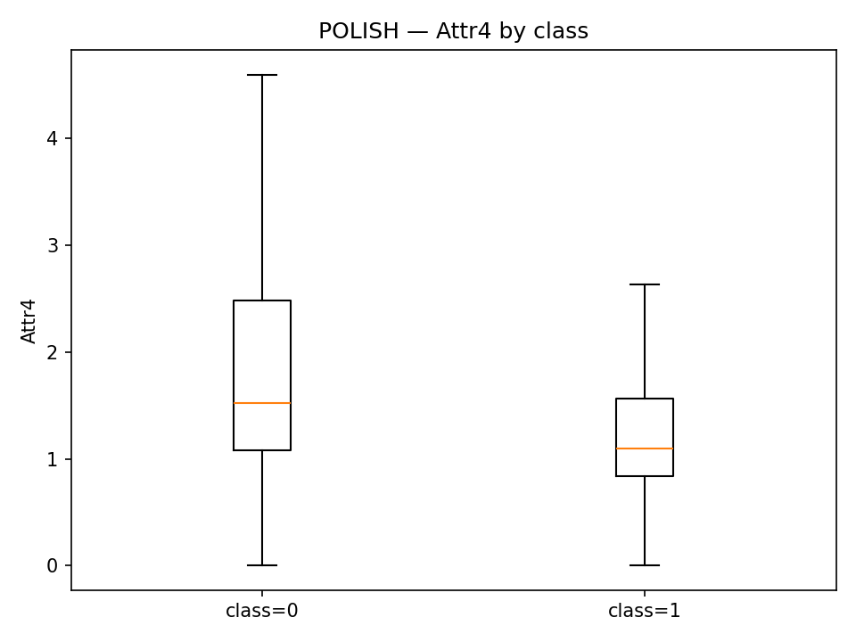

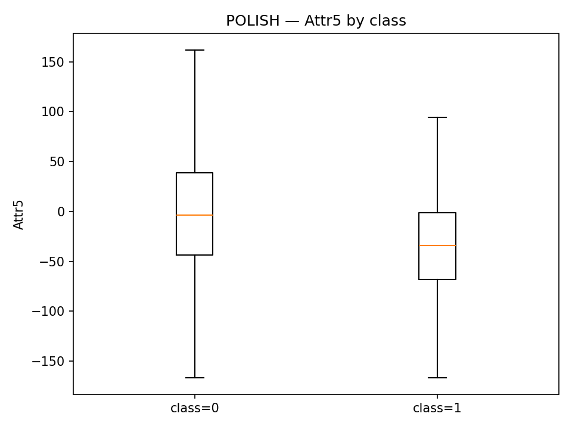

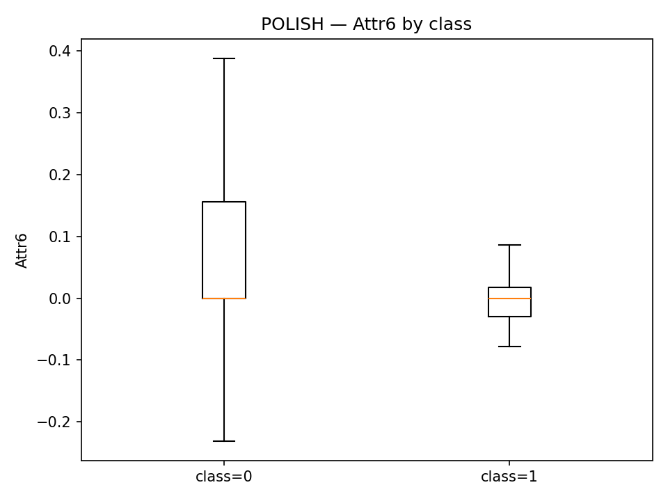

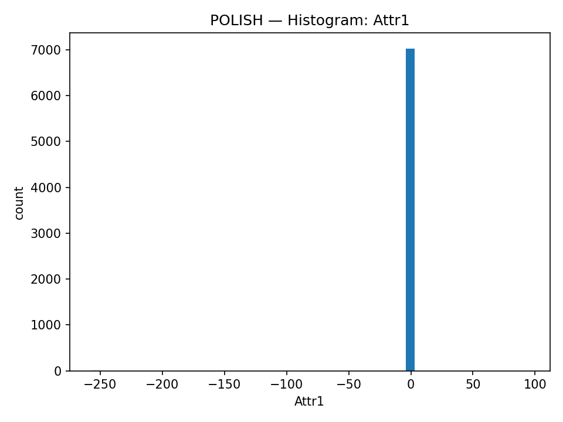

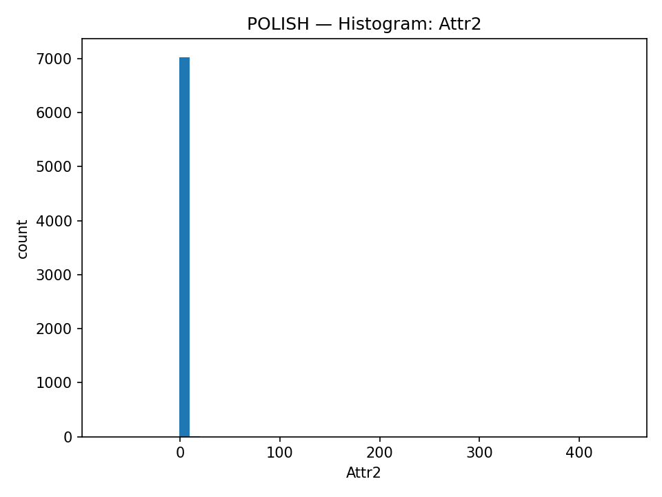

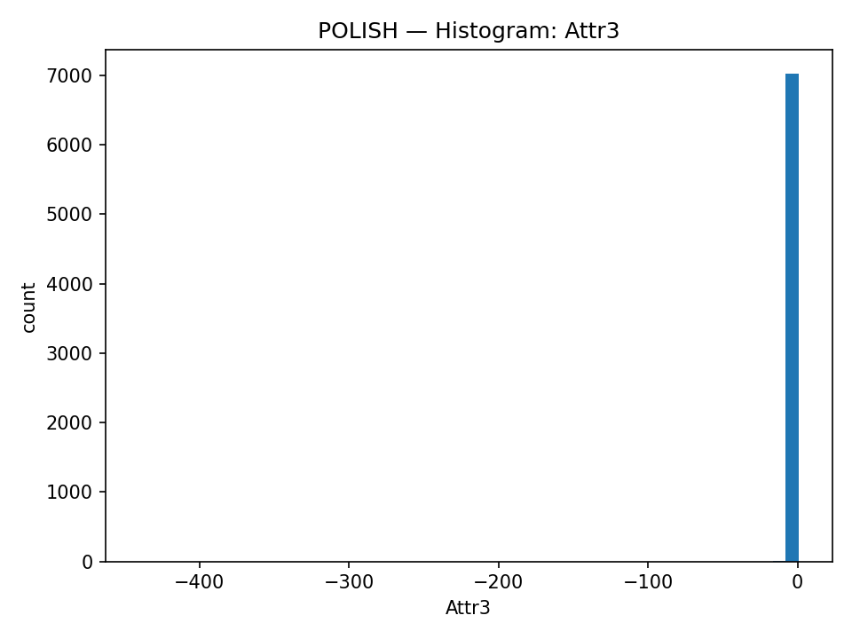

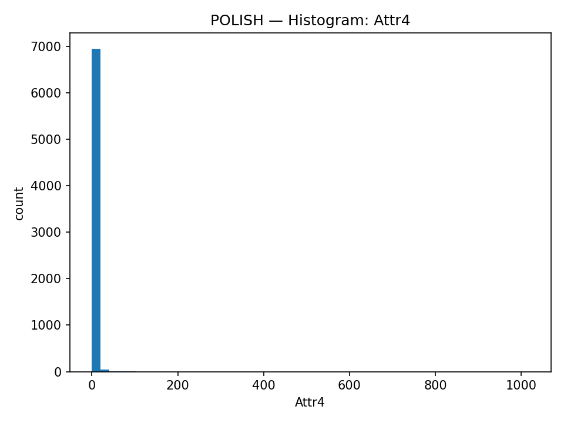

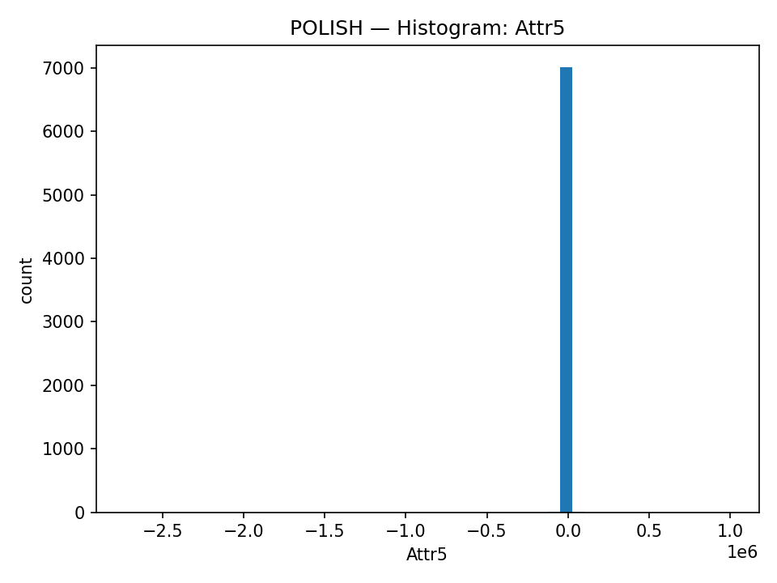

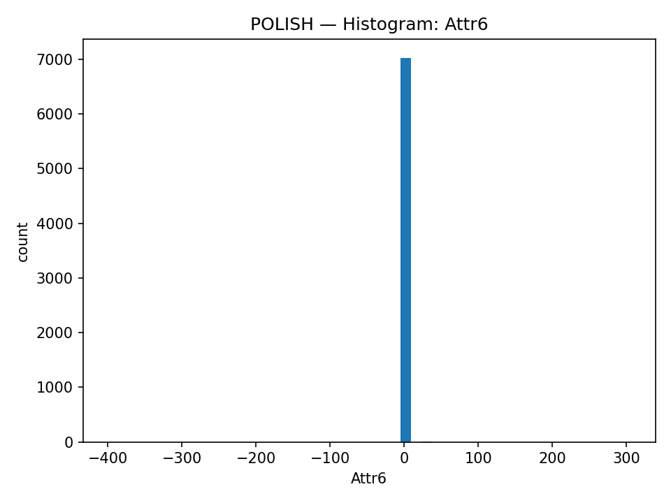

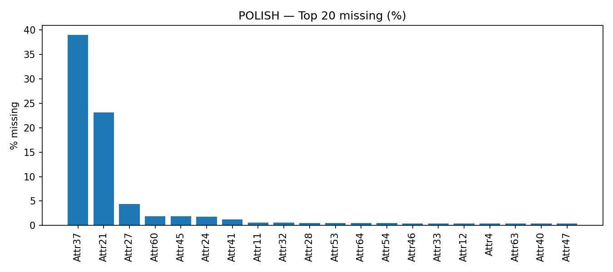

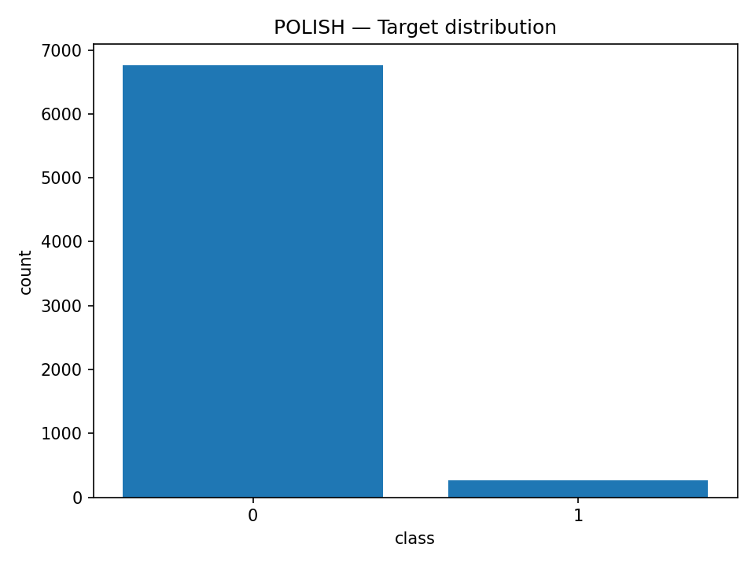

