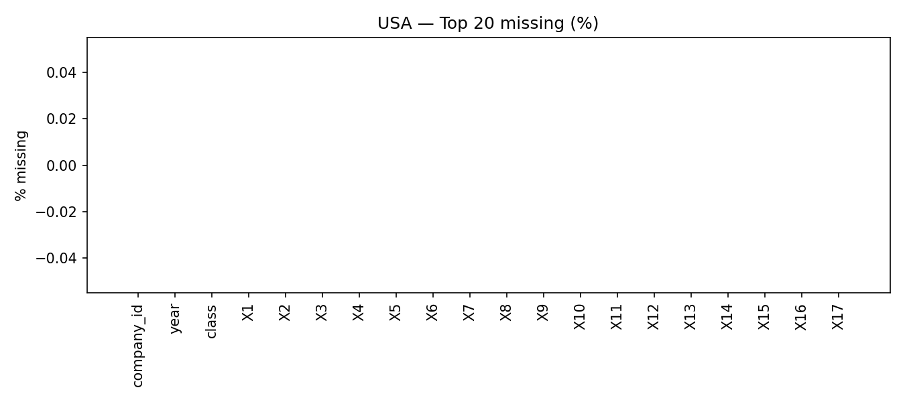

# USA — EDA

**Shape**: 78682 rows × 22 cols  
**Missing (global avg)**: 0.00%  
**Positive rate (class=1)**: 0.0663  
**Target counts**: `{'0': 73462, '1': 5220}`  
**Years**: 1999 → 2018  

## Missing values (top 20)
- `company_id`: 0.00%
- `year`: 0.00%
- `class`: 0.00%
- `X1`: 0.00%
- `X2`: 0.00%
- `X3`: 0.00%
- `X4`: 0.00%
- `X5`: 0.00%
- `X6`: 0.00%
- `X7`: 0.00%
- `X8`: 0.00%
- `X9`: 0.00%
- `X10`: 0.00%
- `X11`: 0.00%
- `X12`: 0.00%
- `X13`: 0.00%
- `X14`: 0.00%
- `X15`: 0.00%
- `X16`: 0.00%
- `X17`: 0.00%

## Figures

